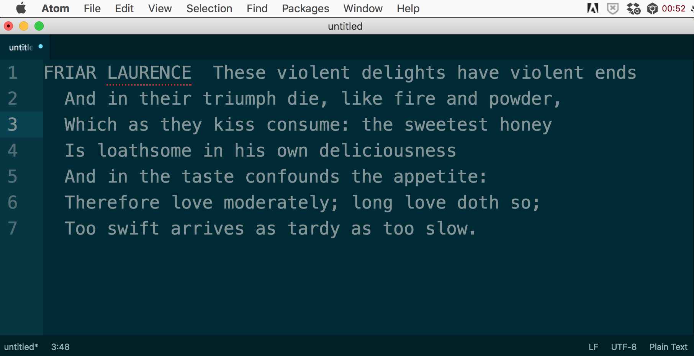
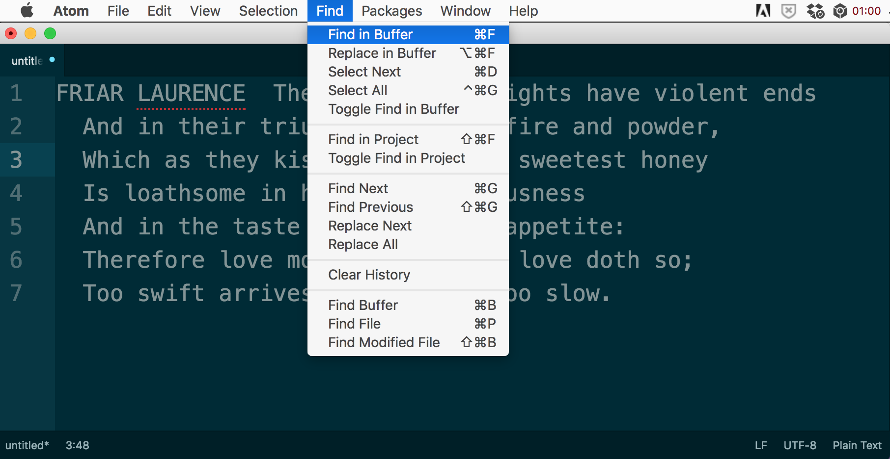
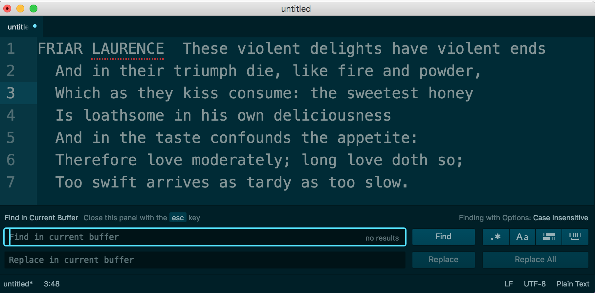
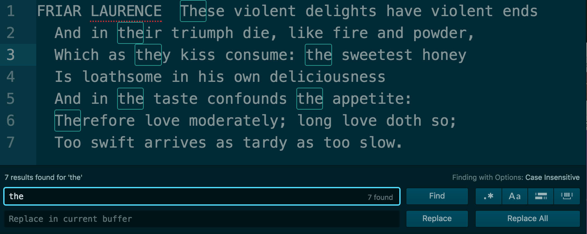
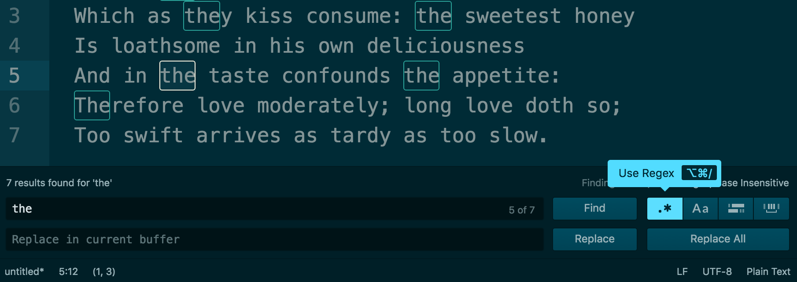
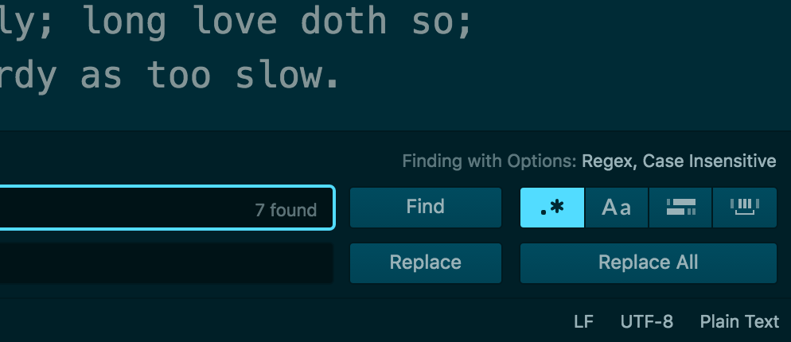
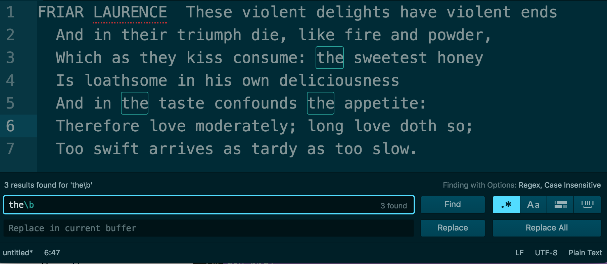
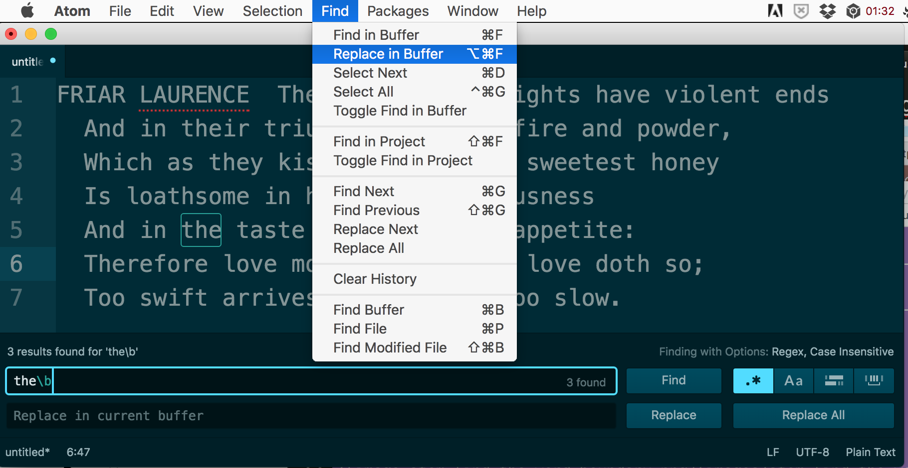
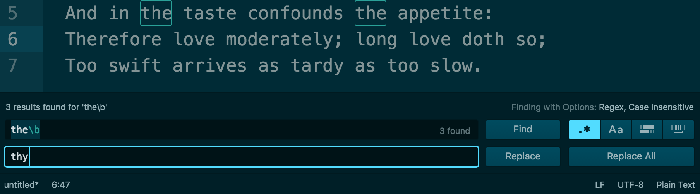
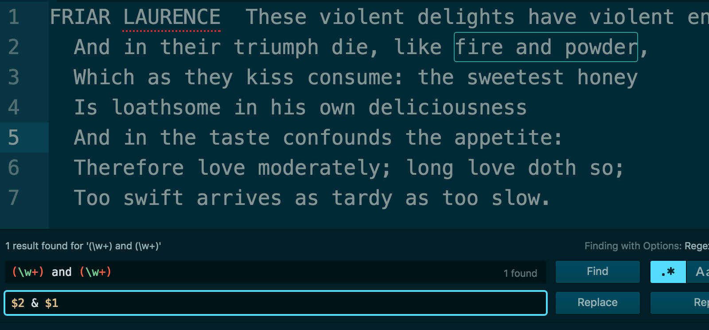

*******************************************
How to practice and use regular expressions
*******************************************

Find and Replace in the Atom Text Editor
========================================

Open the Atom Text Editor and paste the following text `from Romeo and Juliet, Act II, Scene VI`_

.. _from Romeo and Juliet, Act II, Scene VI: http://shakespeare-navigators.com/romeo/T26.html

    FRIAR LAURENCE  These violent delights have violent ends
        And in their triumph die, like fire and powder,
        Which as they kiss consume: the sweetest honey
        Is loathsome in his own deliciousness
        And in the taste confounds the appetite:
        Therefore love moderately; long love doth so;
        Too swift arrives as tardy as too slow.

Find in Buffer (Command-F)
--------------------------

The keyboard shortcut is: :kbd:`Command-F`

The menu is :guilabel:`Find > Find in Buffer`

This opens a bottom panel:

Type in a term to search for, such as ``the``:

Enable regex mode
^^^^^^^^^^^^^^^^^

The button looks like this: :guilabel:`.*` labeled :guilabel:`Use Regex`.

The keyboard shortcut is: :kbd:`Command-Alt-/` (only works if the :guilabel:`Find` panel is highlighted).

Notice the fine print in the top-right of the :guilabel:`Find` panel:

    :guilabel:`Finding with Options: Regex, Case Insensitive`

Now, let's use a proper regular expression -- instead of finding all instances of :regexp:`the`, including "**the**\ ir" and "**the**\ y", let's limit it to *just* "the".

:regexp:`the\\b`

That `\b`, i.e. *backslash-b* is a :doc:`word boundary </regular-expressions/anchors-boundaries>`.

Replace in Buffer
-----------------

TK

Shortcut: :kbd:`Command-Alt-F`

Or you could just hit :kbd:`Command-F` and then :kbd:`Tab`

TK: This simply highlights the :guilabel:`Replace in current buffer` field, i.e. the field in which we specify with what the *found* text should be replaced.

Let's try ``thy``:

It works as Find-and-Replace functionality does in any word processor you've ever used.

Replace a capturing group
^^^^^^^^^^^^^^^^^^^^^^^^^

TK

Let's do a proper regex: replace all **4-letter-words** with `****`.

To **find** all text consisting of exactly 4 alphabet letters requires the use of :doc:`word boundaries </regular-expressions/anchors-boundaries>`, :doc:`character classes </regular-expressions/character-classes>`, and :doc:`limited repetition </regular-expressions/limited-repetition>`:

:regexp:`\\w+ and \\w+`

But we want to use a :doc:`capturing group </regular-expressions/capturing-groups>`:

:regexp:`(\\w+) and (\\w+)`

And in the **replace** field:

``$2 & $1``

Notice the change. From:

    And in their triumph die, like fire and powder

To:

    And in their triumph die, like powder & fire,

Finding across an entire project
================================

Incremental finding
===================

